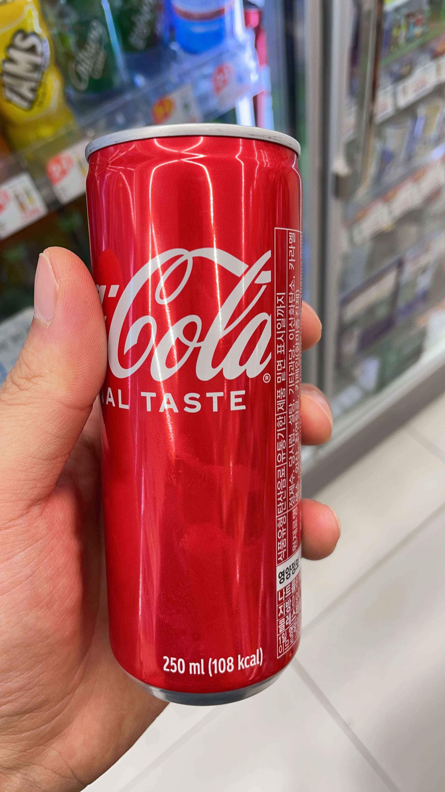
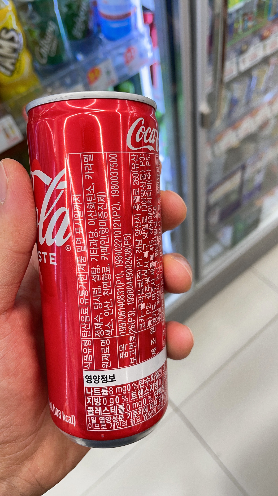
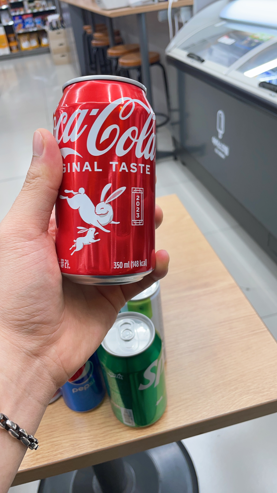
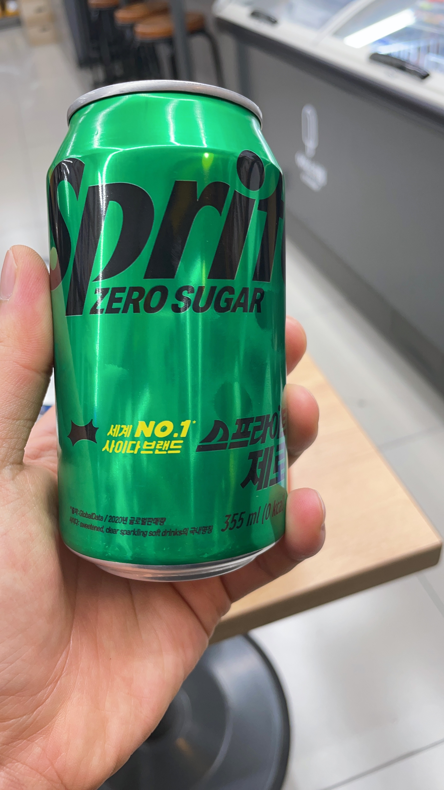
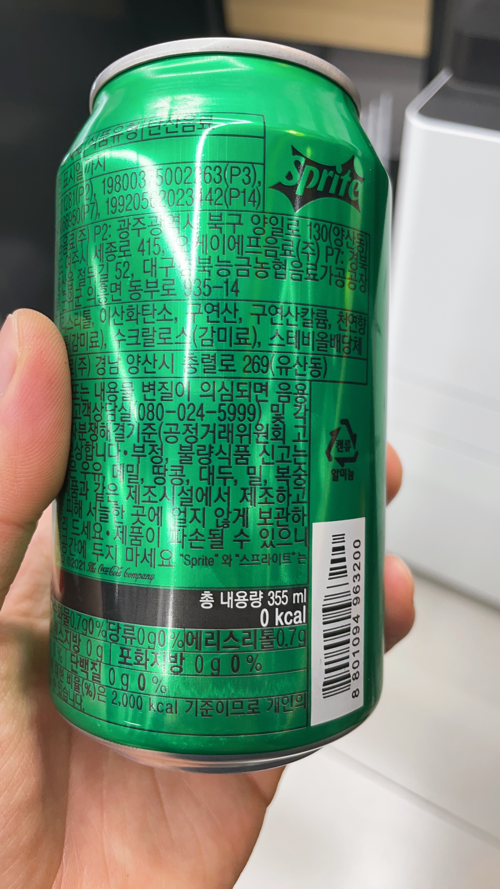
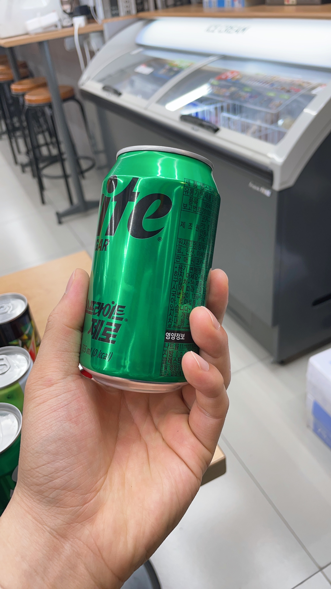

# Build Deep Learning Model for blind individuals

- Models: [ShuffleNetV2](https://arxiv.org/abs/1807.11164), [MobileNetV3](https://arxiv.org/abs/1905.02244), [MNASNet](https://arxiv.org/abs/1807.11626), [EfficientNetV2](https://arxiv.org/abs/2104.00298)
- Number of Parameters (based on 33 classes):

| ShuffleNetV2 (x0.5) | MobileNetV3 (small) |  MNASNet  | EfficientNetV2 |
| :------------------: | :-----------------: | :-------: | :------------: |
|       375,617       |      1,551,681      | 5,043,529 |   20,219,761   |

### Overview

**The Pipeline of our Process with simple CNN architecture**

<div align='center'>
    
</div>

**Features**

- To avoid image distortion, we apply **padding** and resize processing. ([code](https://github.com/BlindOver/blindover_AI/blob/d414b5aad9844feda26e95afc6f0b44c5247378f/utils/dataset.py#L32))

  ```python
  from utils.dataset import Padding
  from PIL import Image

  img = Image.open('image.png')
  padded_img = Padding()(img)
  ```
- To maximize performance of model on mobile devices, we **trained various models** such as Efficient, MobileNetV3, ShuffleNetV2 and MNASNet and compare their accuracy and inference speed. ([code](https://github.com/BlindOver/blindover_AI/tree/main/models))
- **To accelerate inference speed**, we trained a **quantized** model and compared its performance of accuracy and inference speed with base model. ([codes](https://github.com/Sangh0/blindover_AI/tree/main/quantization/quantization.py))

  ```
  python ./quantization/quantization.py --model_name {model name} --weight {weight path} --num_classes 33
  ```
- To address the issue of insufficient data, we utilize **image generation models** such as [Diffusion](https://stablediffusionweb.com/) and [DALL-E](https://openai.com/dall-e-2) to increase the number of samples. ([code](https://github.com/BlindOver/blindover_AI/blob/main/composite.py))

  ```
  python ./composite.py --foreground_path {'foreground images directory'} --background_path {'background images directory'} --save_dir {'save folder directory'}
  ```

### Dataset

**Sample Images**

- Coca Cola

<div align='center'>
    <a href='./'>
        
    </a>
    <a href='./'>
        
    </a>
    <a href='./'>
        
    </a>
</div>

- Sprite Zero

<div align='center'>
    <a href='./'>
        
    </a>
    <a href='./'>
        
    </a>
    <a href='./'>
        
    </a>
</div>

- Composite Images

<div align='center'>
    <a href='./'>
        
    </a>
</div>

**Classes**

|        2% (0)        |         박카스 (1)         | 칠성 사이다 (2) | 칠성 사이다 제로 (3) |   초코 우유 (4)   |  코카 콜라 (5)  |
| :------------------: | :------------------------: | :-------------: | :------------------: | :----------------: | :--------------: |
|  데미소다 사과 (6)  |    데미소다 복숭아 (7)    |   솔의눈 (8)   |   환타 오렌지 (9)   |   게토레이 (10)   |    제티 (11)    |
|      맥콜 (12)      |         우유 (13)         |   밀키스 (14)   |   밀키스 제로 (15)   |   마운틴듀 (16)   |    펩시 (17)    |
|    펩시 제로 (18)    |     포카리 스웨트 (19)     | 파워에이드 (20) |     레드불 (21)     |     식혜 (22)     | 스프라이트 (23) |
| 스프라이트 제로 (24) |       딸기 우유 (25)       |  비타 500 (26)  | 브이톡 블루레몬 (27) | 브이톡 복숭아 (28) | 웰치스 포도 (29) |
|  웰치스 오렌지 (30)  | 웰치스 화이트그레이프 (31) | 제로 콜라 (32) |          -          |         -         |        -        |

**Directory Guide**

```
path : dataset/
├── images
│    ├─ class 1
│        ├─ img1.jpg
│        ├─ ...
│    ├─ class 2
│        ├─ img1.jpg
│        ├─ ...
│    ├─ class 3
│        ├─ img1.jpg
│        ├─ ...
│    ├─ ...
│        ├─ ...
│        ├─ ...
```

### Install virtual environment in Anaconda

```
conda create -n blindover python==3.8
conda activate blindover
cd ./blindover_AI
pip install -r requirements.txt
```

### Training

```
python3 train.py --data_path '{dataset directory}' --name 'exp' --model '{the one of 4 models}' --pretrained --img_size 224 --num_workers 8 --batch_size 32 --epochs 100 --optimizer 'momentum' --lr_scheduling --check_point
```

### Testing

- Testing model to evaluate the performance in test set

```
python3 test.py --data_path '{dataset directory}' --model '{the one of 4 models}' --weight './runs/exp/weights/best.pt' --img_size 224 --num_workers 8 --batch_size 32 --num_classes 100
```

### Acknowledgements

- assisted in dataset collection (데이터셋 수집에 도움 주신 분들): [이마트24 용인 명지대점](https://map.naver.com/v5/search/%EC%9D%B4%EB%A7%88%ED%8A%B824%20%EC%9A%A9%EC%9D%B8%20%EB%AA%85%EC%A7%80%EB%8C%80%EC%A0%90/place/1019132650?c=15,0,0,2,dh&isCorrectAnswer=true), [하나로마트 오산농협본점](https://map.naver.com/v5/search/%EC%98%A4%EC%82%B0%20%EB%86%8D%ED%98%91%20%ED%95%98%EB%82%98%EB%A1%9C%EB%A7%88%ED%8A%B8%20%EB%B3%B8%EC%A0%90/place/13373937?c=15,0,0,2,dh&placePath=%3Fentry%253Dpll)
