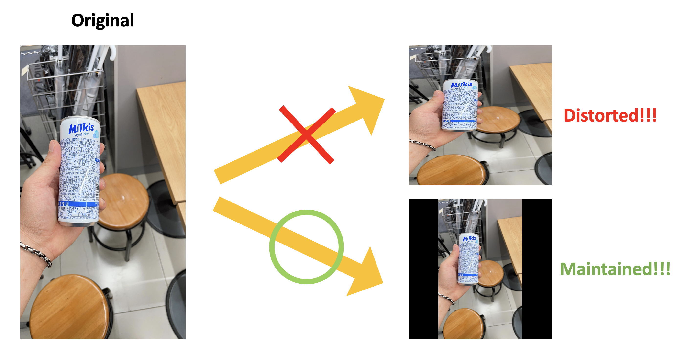
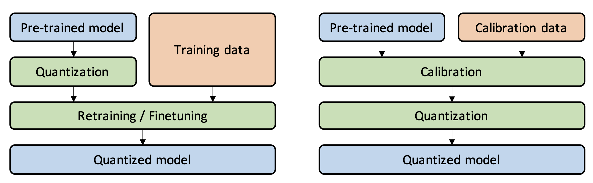

## Build Deep Learning Model to classify beverages for blind individuals

- Models: [`ShuffleNetV2`](https://arxiv.org/abs/1807.11164), [`MobileNetV3`](https://arxiv.org/abs/1905.02244), [`EfficientNetV2`](https://arxiv.org/abs/2104.00298), [`ResNet`](https://arxiv.org/abs/1512.03385)
- Number of Parameters (based on 33 classes):

    | ShuffleNetV2 (x0.5)  | MobileNetV3 (small) | EfficientNetV2 |  ResNet18  |  ResNet50  |
    | :------------------: | :-----------------: | :------------: | :--------: | :--------: |
    |       375,617        |      1,551,681      |   20,219,761   | 11,193,441 | 23,575,649 |

### Training and Test

**Install virtual environment in Anaconda**

```
conda create -n blindover python==3.8
conda activate blindover
cd ./blindover_AI
pip install -r requirements.txt
```

**Plattform**

- RTX 3090 GPU
- CUDA 11.7
- CUDNN 8.5
- PyTorch 1.13

**Training**

```
python3 train.py --data_path 'the/directory/of/dataset' --name exp --model {the one of 5 models} --pretrained --img_size 224 --num_workers 8 --batch_size 4 --epochs 100 --optimizer adam --lr_scheduling --check_point
```

**Test**

```
python3 evaluate.py --data_path 'the/directory/of/dataset' --model resnet18 --weight 'the/path/of/trained/weight/file' --img_size 224 --num_workers 8 --batch_size 32 --num_classes 33
```

**Inference**

```
python3 inference.py --src 'the/directory/of/image' --model_name resnet18 --weight 'the/path/of/trained/weight/file' --quantization --measure_latency
```

### Overview

**The Pipeline of our Process with simple CNN architecture**

<div align='center'>
    
</div>

**Features**

- To avoid image distortion, we applied **padding** and resize processing. ([`code`](https://github.com/BlindOver/blindover_AI/blob/d414b5aad9844feda26e95afc6f0b44c5247378f/utils/dataset.py#L32))

    ```python
    from utils.dataset import Padding
    from PIL import Image

    img = Image.open('./image.png')
    padded_img = Padding()(img)
    ```

    - Correct and Incorrect examples
    
        <div align='center'>
            <a href='./'>
                
            </a>
        </div>

- To maximize the performance of model on mobile device or virtual server, we **trained various models** such as EfficientNetV2, MobileNetV3, ShuffleNetV2 and ResNet, and compared the accuracy and inference speed between these models. ([`code`](https://github.com/BlindOver/blindover_AI/tree/main/models)) The experimental results for this are pressented in [`Results`](https://github.com/BlindOver/blindover_AI/tree/main/quantization)

- **To accelerate inference speed**, we performed **quantization** (QAT and PTQ) and compared its performance of accuracy and inference speed with base model. Also, we provied the experimental results for quantization. ([`README`](https://github.com/BlindOver/blindover_AI/blob/main/quantization/README.md)) 

    - Comparison between QAT and PTQ ([`source of figure`](https://arxiv.org/abs/2103.13630))
    
    
        <div align='center'>
            <a href='./'>
                
            </a>
        </div>


    ```
    # Convert file from float32 to uint8 with PTQ mode

    python3 ./convert_ptq_mode.py --data_path 'the/path/of/dataset' --model_name 'model name' --weight 'path/of/trained/weight/file'
    ```

    

- To address the issue of insufficient data, we utilized **image generation models** such as [Diffusion](https://stablediffusionweb.com/) and [DALL-E](https://openai.com/dall-e-2) to increase the number of samples. Also, we applied random image transformation such as colorization, sharpness, contrast and brightness to make slight changes to the image instead of original image. ([`code`](https://github.com/BlindOver/blindover_AI/blob/main/composite.py))

    ```
    python3 ./composite.py --foreground_path 'the/path/of/foregorund/images' --background_path 'the/path/of/background/images' --save_dir 'a/folder/to/save/generated/images'
    ```

        
    - Examples of composite image

        <div align='center'>
            <a href='./'>
                
            </a>
        </div>

### Dataset

- We collected 10 to 15 images per class and then augmented the training data through image composite.

**Sample Images**

- Coca Cola

<div align='center'>
    <a href='./'>
        
    </a>
    <a href='./'>
        
    </a>
    <a href='./'>
        
    </a>
</div>

- Sprite Zero

<div align='center'>
    <a href='./'>
        
    </a>
    <a href='./'>
        
    </a>
    <a href='./'>
        
    </a>
</div>


**Classes**

|        2% (0)        |         박카스 (1)         | 칠성 사이다 (2) | 칠성 사이다 제로 (3) |   초코 우유 (4)   |  코카 콜라 (5)  |
| :------------------: | :------------------------: | :-------------: | :------------------: | :----------------: | :--------------: |
|  데미소다 사과 (6)      |    데미소다 복숭아 (7)    |   솔의눈 (8)   |   환타 오렌지 (9)   |   게토레이 (10)   |    제티 (11)    |
|      맥콜 (12)        |        우유 (13)         |   밀키스 (14)   |   밀키스 제로 (15)   |   마운틴듀 (16)   |    펩시 (17)    |
|    펩시 제로 (18)      |     포카리 스웨트 (19)     | 파워에이드 (20) |     레드불 (21)     |     식혜 (22)     | 스프라이트 (23) |
| 스프라이트 제로 (24)    |       딸기 우유 (25)       |  비타 500 (26)  | 브이톡 블루레몬 (27) | 브이톡 복숭아 (28) | 웰치스 포도 (29) |
|  웰치스 오렌지 (30)     | 웰치스 화이트그레이프 (31) | 제로 콜라 (32) |          -          |         -         |        -        |

**Dataset Structure**

```
path : dataset/
├── images
│    ├─ class 1
│        ├─ img1.jpg
│        ├─ ...
│    ├─ class 2
│        ├─ img1.jpg
│        ├─ ...
│    ├─ class 3
│        ├─ img1.jpg
│        ├─ ...
│    ├─ ...
│        ├─ ...
│        ├─ ...
```

### Acknowledgements

- Assisted in Dataset Collection (데이터셋 수집에 도움 주신 분들): [이마트24 용인 명지대점](https://map.naver.com/v5/search/%EC%9D%B4%EB%A7%88%ED%8A%B824%20%EC%9A%A9%EC%9D%B8%20%EB%AA%85%EC%A7%80%EB%8C%80%EC%A0%90/place/1019132650?c=15,0,0,2,dh&isCorrectAnswer=true), [하나로마트 오산농협본점](https://map.naver.com/v5/search/%EC%98%A4%EC%82%B0%20%EB%86%8D%ED%98%91%20%ED%95%98%EB%82%98%EB%A1%9C%EB%A7%88%ED%8A%B8%20%EB%B3%B8%EC%A0%90/place/13373937?c=15,0,0,2,dh&placePath=%3Fentry%253Dpll)